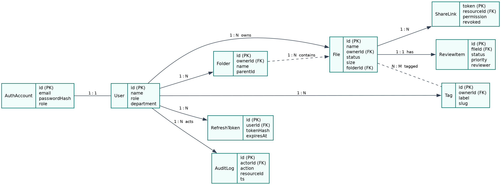
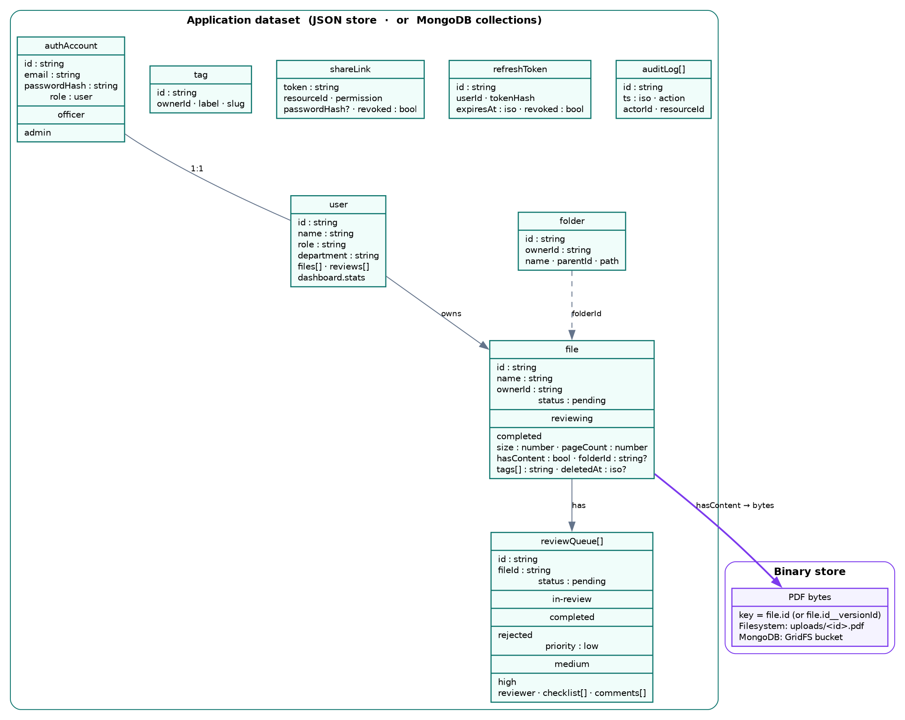
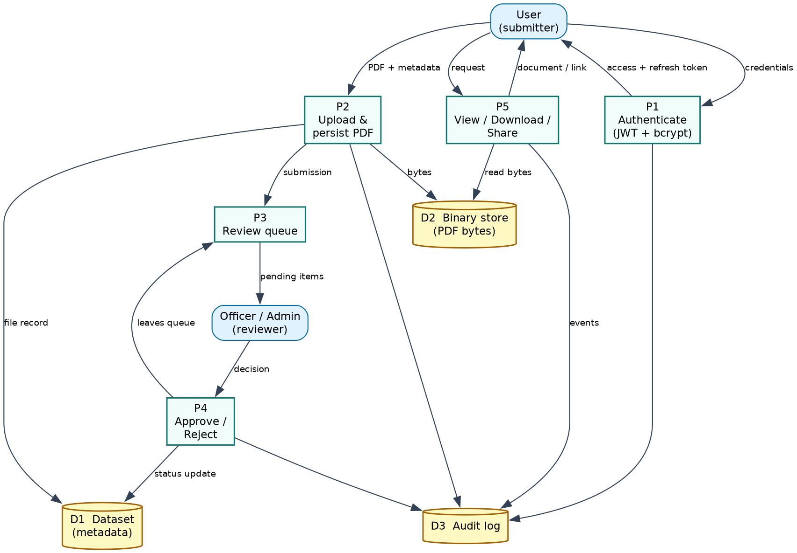
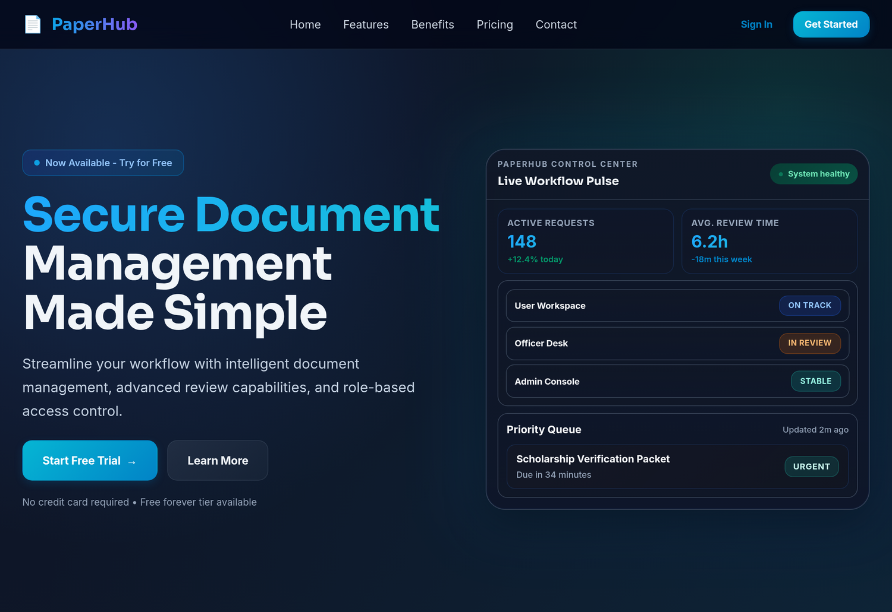
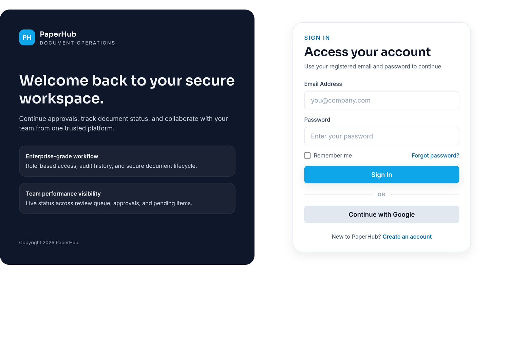
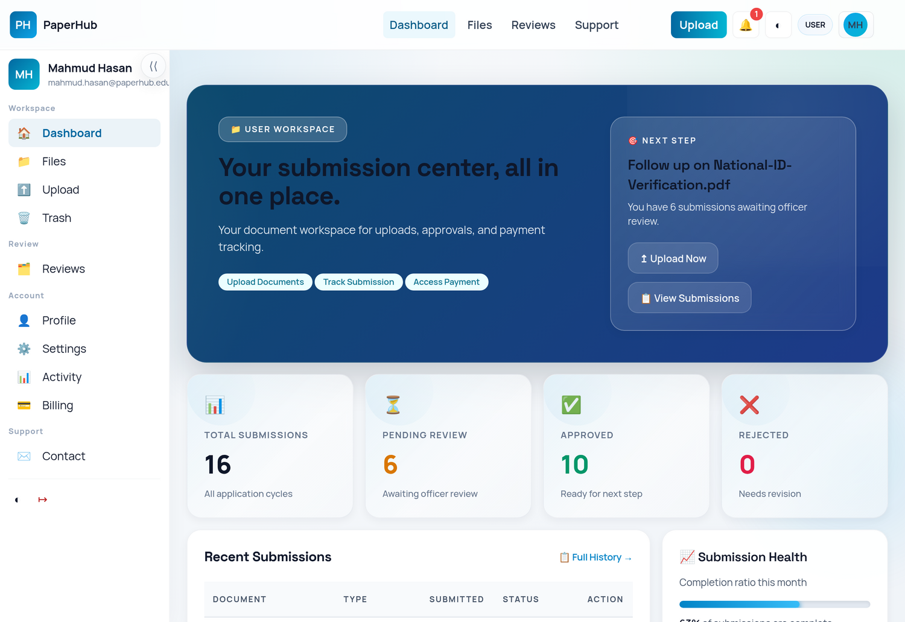
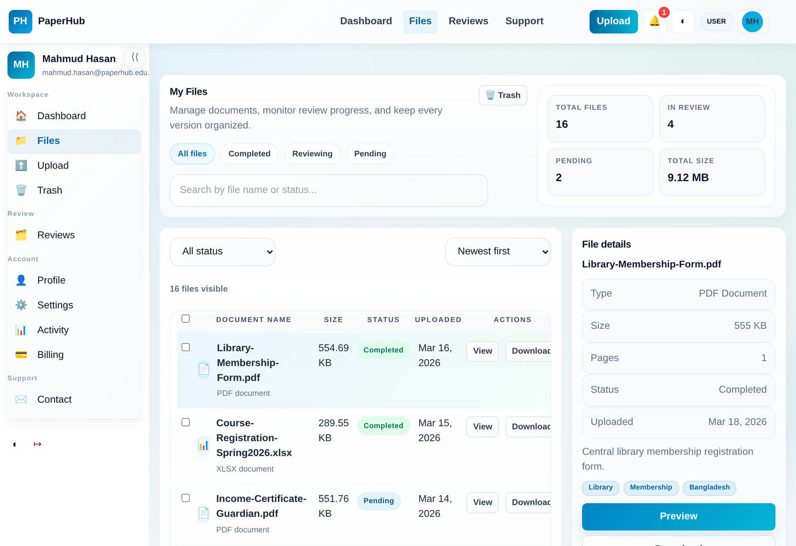
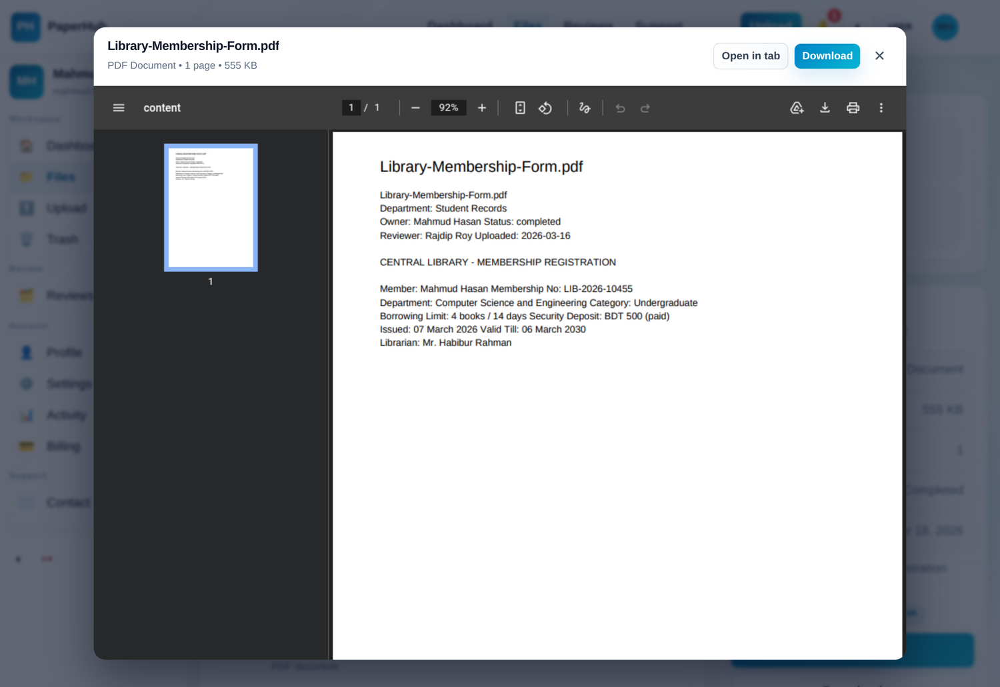
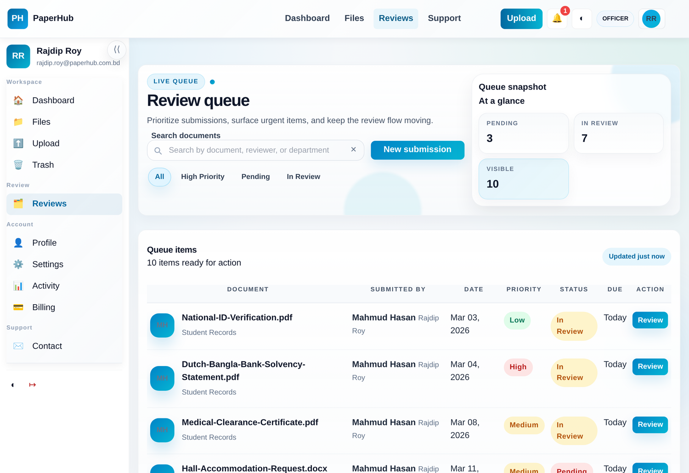
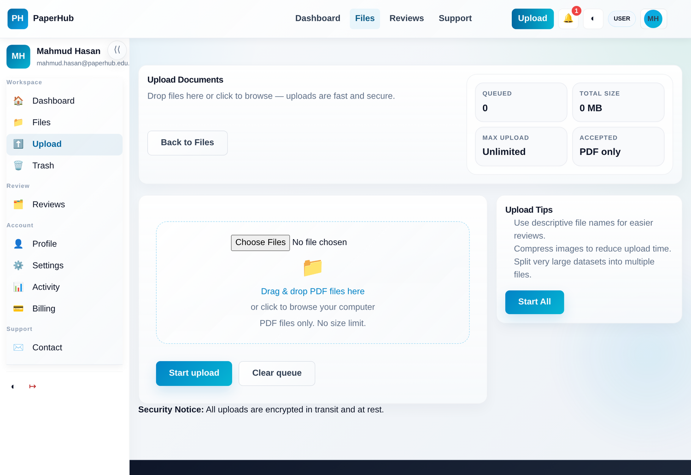

Patuakhali Science and Technology University

Faculty of Computer Science and Engineering

CIT 320 :: Software Development Project-II

Project Report

PaperHub

<strong>Project Title :</strong> PaperHub

Submission Date : 25 June 2026

<table class="cover-table">
<tr><th>Submitted from,</th><th>Submitted to,</th></tr>
<tr>
<td>
<strong>Md. Sharafat Karim</strong> 
<strong>ID</strong> : 2102024, 
<strong>Reg</strong> : 10151, 
<strong>Semester</strong> : 6 
(Level-3, Semester-2)
</td>
<td>
1. <strong>Md Mahbubur Rahman</strong> 
Associate Professor, 
Department of Computer Science and Information Technology, 
Patuakhali Science and Technology University.  
2. <strong>Md Atikqur Rahaman</strong> 
Professor, 
Department of Computer Science and Information Technology, 
Patuakhali Science and Technology University.
</td>
</tr>
</table>

## Contents

1. [Introduction](#1-introduction)
2. [Objectives](#2-objectives)
3. [Problem Statement](#3-problem-statement)
4. [Literature Review](#4-literature-review)
5. [Related Commercial Projects](#5-related-commercial-projects)
6. [Scope](#6-scope)
   - 6.1 [Job Market Analysis](#61-job-market-analysis)
7. [Methodology](#7-methodology)
   - 7.1 [Technology Stack](#71-technology-stack)
   - 7.2 [Design Principles](#72-design-principles)
8. [Feature Comparison](#8-feature-comparison)
9. [Visual Models](#9-visual-models)
   - 9.1 [ERD (Entity Relationship Diagram)](#91-erd-entity-relationship-diagram)
   - 9.2 [Schema Diagram](#92-schema-diagram)
   - 9.3 [Data Flow Diagram](#93-data-flow-diagram)
   - 9.4 [Timeline (Gantt Chart)](#94-timeline-gantt-chart)
10. [UI Mockups](#10-ui-mockups)
11. [Future Plans](#11-future-plans)
12. [Result](#12-result)
13. [Conclusion](#13-conclusion)
14. [References](#14-references)

# PaperHub

## 1. Introduction

PaperHub is a secure, self-hostable **document-management and review platform**. It lets an organisation receive documents (PDFs), route each one through a human **review/approval workflow**, and then share, version, or archive it — all under strict, role-based access control. It is built for a Bangladeshi administrative context (admission forms, certificates, scholarship applications and office orders) but is domain-agnostic.

Unlike toy CRUD demos, PaperHub is implemented with **production-grade security primitives**: bcrypt password hashing, signed JSON Web Token (JWT) access tokens, opaque server-revocable refresh tokens, three-role access control, per-resource ownership checks, an append-only audit log, and a per-viewer data-scoping layer that prevents one user's data from ever reaching another. The backend is a small REST API placed over a **pluggable storage façade** that runs identically on a zero-dependency JSON file store or on MongoDB with GridFS.

## 2. Objectives

1. To build a multi-user web platform for submitting, reviewing, organising and sharing PDF documents.
2. To implement production-style authentication — bcrypt-hashed passwords, signed JWT access tokens, and revocable refresh tokens — so a session is secure yet long-lived.
3. To enforce three-role access control (user, officer, admin) together with per-resource ownership, so each actor can only see and do what they are entitled to.
4. To provide a submission → review-queue → approve/reject workflow, with a decided document leaving the actionable queue.
5. To store real document bytes safely (filesystem or GridFS) with inline preview, download, sharing, versioning and a recoverable Trash.
6. To keep the architecture storage-agnostic and to guard every operation with automated tests and quality gates.

## 3. Problem Statement

Organisations routinely receive documents that must be **verified by a human, approved or rejected, tracked, and retained**. The common stand-ins — shared drives, spreadsheets and email threads — offer no real access control, no review workflow, no audit trail, and no single source of truth, so accountability and recovery suffer.

The mature commercial alternatives are fragmented and restrictive. General storage tools (Google Drive, Dropbox) are not review systems; e-signature tools (DocuSign) are narrow and costly; enterprise content platforms (SharePoint, M-Files) are heavyweight and licence-bound. Many lock essential capabilities — fine-grained roles, audit logging, versioning, self-hosting — behind paywalls or proprietary stacks, with no anonymous or self-hosted option. There is a need for a **unified, self-hostable, security-first** platform that combines storage, a human approval workflow, and strict access control in one auditable system.

## 4. Literature Review

The foundations of PaperHub draw on several well-established bodies of work.

According to Sandhu et al.'s seminal _Role-Based Access Control Models_ [1], assigning permissions to **roles** (and users to roles) rather than directly to users dramatically simplifies the administration of access in multi-user systems. Ferraiolo et al. later consolidated this into the _Proposed NIST Standard for RBAC_ [2], formalising core and hierarchical RBAC. PaperHub adopts the core RBAC model with three roles — user, officer and admin — and augments it with a per-resource **ownership/ACL** check for cases that pure role checks are too coarse to express (e.g. sharing a single document).

For authentication, the _JSON Web Token_ specification, RFC 7519 [3], defines a compact, signed, **stateless** token that a server can verify without a session lookup. However, a pure-JWT design cannot revoke a token before it expires. Following the access/refresh separation popularised by the _OAuth 2.0 Authorization Framework_, RFC 6749 [4], PaperHub pairs a short-to-long-lived signed JWT with an **opaque, server-stored refresh token** (only its SHA-256 hash is persisted) that can be revoked on logout — combining stateless performance with server-side control.

For credential storage, Provos and Mazières's _A Future-Adaptable Password Scheme_ [5] introduced bcrypt, whose adaptive cost factor keeps password hashing expensive as hardware improves, resisting offline cracking. PaperHub never stores plaintext passwords; seed credentials are migrated to bcrypt hashes on first login.

At the architectural level, Fielding's dissertation on the _REST_ architectural style [6] underpins the platform's stateless, resource-oriented JSON API. Security requirements were driven by the _OWASP Top 10_ [7], whose number-one risk — Broken Access Control — directly motivated PaperHub's write-policy and per-viewer scoping layers. Finally, Päivärinta and Munkvold's work on _Enterprise Content Management_ [8] frames the metadata + workflow + access-control triad that defines a document-management system, which PaperHub implements end-to-end.

## 5. Related Commercial Projects

1. **Google Drive** [9] is excellent general-purpose storage and collaboration, but it is _not_ a review/approval system: there is no built-in submission queue, no officer/approve-reject workflow, and no self-hosting. Fine-grained, auditable, role-based governance requires Google Workspace administration.
2. **Dropbox** [10] focuses on file sync and sharing. It lacks a native human-review workflow and role separation between submitter and reviewer, and advanced controls sit behind business tiers; it cannot be self-hosted.
3. **DocuSign** [11] is the industry standard for e-signature and document agreements, but it is narrow (signing-centric), expensive, and not a general document store or RSS-style review queue; it is closed-source and SaaS-only.
4. **Microsoft SharePoint** [12] offers enterprise content management with workflows, but it is heavyweight, licence-bound to the Microsoft ecosystem, complex to operate, and not realistically self-hostable for a small team or as FOSS.
5. **M-Files** [13] provides metadata-driven document management with workflows, but it is a proprietary, licence-heavy enterprise product without an open, self-hosted, anonymous-friendly option.
6. **Raindrop.io** [14] is a polished bookmark/document organiser, but it is limited to saving and tagging items — it has no submission/approval workflow, no role-based reviewer model, no self-hosting, and locks key features behind a paid tier.

In short, existing tools are either _storage without workflow_, _signing without storage_, or _enterprise CMS without affordable self-hosting_. PaperHub targets the gap: an affordable, self-hostable, security-first platform that unifies storage, a human review workflow, and strict access control.

## 6. Scope

PaperHub is developed as a server-rendered-plus-REST web application on **Node.js and Express 5**, with a framework-light vanilla-JavaScript front end styled with Tailwind CSS. It natively supports uploading PDF documents, routing them through a review queue, approving/rejecting them, and organising them with folders and tags, sharing, versioning, and a recoverable Trash.

Persistence is **pluggable**: by default a JSON file store keeps metadata with PDF bytes on the filesystem; setting a `MONGODB_URI` switches the same API to MongoDB with GridFS for the binaries — with no change to the front end. The platform ships with bcrypt authentication, JWT + refresh-token sessions, RBAC, per-viewer data scoping, an append-only audit log, and a 150-plus-case automated test suite. It can be hosted on any Node-capable environment (e.g. a VPS, Render, or a container).

### 6.1 Job Market Analysis

The job market for full-stack web developers in Bangladesh is growing rapidly, with strong demand for the Node.js/Express/JavaScript stack that PaperHub is built on. Representative listings on major portals consistently request these skills:

| Job Portal                      | Link                                                        | Stack in demand                                                |
| ------------------------------- | ----------------------------------------------------------- | -------------------------------------------------------------- |
| BDJobs                          | <https://www.bdjobs.com/> (search: "Node.js", "Full Stack") | Node.js, Express, JavaScript, MongoDB, REST API, Git           |
| Careerjet Bangladesh [16]       | <https://www.careerjet.com.bd/>                             | Node.js, React/Vue, MongoDB/PostgreSQL, JWT, Tailwind CSS      |
| LinkedIn Jobs (Bangladesh) [17] | <https://www.linkedin.com/jobs/>                            | Node.js, Express, TypeScript, MongoDB, authentication/security |
| Skill.jobs / Glassdoor          | <https://skill.jobs/>                                       | Full-stack JavaScript, REST, Git, cloud deployment             |

_Table 1: Representative job-market demand for the Node.js/Express full-stack profile in Bangladesh._

The prevalence of Node.js, Express, MongoDB and authentication/security in these listings makes PaperHub a timely project: it demonstrates exactly the back-end, security and full-stack skills that the market rewards.

## 7. Methodology

The development of PaperHub followed an **incremental, test-driven** methodology: the project was built in phases (security foundation → organisation → sharing → SaaS essentials), each landing with automated tests before the next began.

### 7.1 Technology Stack

1. **Runtime / API:** Node.js with Express 5 (REST endpoints, middleware, static hosting).
2. **Front end:** Vanilla JavaScript (ES modules-as-globals), HTML5.
3. **Styling:** Tailwind CSS (utility-first), responsive layout, single-page-style navigation.
4. **Authentication:** `jsonwebtoken` (signed JWT access tokens) and `bcryptjs` (password hashing); opaque, hashed, revocable refresh tokens.
5. **Storage (default):** JSON file store with PDF bytes written under an `uploads/` directory.
6. **Storage (optional):** MongoDB with GridFS for binaries of any size — selected automatically when `MONGODB_URI` is set.
7. **Server PDF tooling:** a dependency-free page counter that inflates PDF object streams.
8. **Testing / quality:** Node's built-in `node:test` runner with `jsdom` for DOM tests, plus ESLint and Prettier, run by a single `check` command.
9. **Hosting:** any Node environment (VPS / container / PaaS); GitHub for version control.

### 7.2 Design Principles

1. **Security first.** Every request is authenticated and authorised; a non-admin's whole-dataset write is constrained to its own slice, and reads are scoped per viewer so credentials and other users' data never leak.
2. **Storage-agnostic.** A single façade isolates the persistence choice, so the file store and MongoDB are interchangeable behind one interface.
3. **Robust by default.** Failed uploads roll back cleanly; a deleted file lands in a recoverable Trash; the dataset read is uncacheable so counts never go stale.
4. **Framework-light.** A small, dependency-conscious code base (four runtime dependencies) keeps the system easy to audit and deploy.
5. **Test-guarded.** Behaviour is locked by an automated suite covering auth, access control, workflow, storage and uploads.

## 8. Feature Comparison

Table 2 contrasts PaperHub with widely used storage, e-signature and content-management tools across the capabilities that matter for a secure document-review platform.

| Capability                             | PaperHub | Google Drive | Dropbox | DocuSign  | SharePoint | Raindrop |
| -------------------------------------- | :------: | :----------: | :-----: | :-------: | :--------: | :------: |
| Self-hostable                          |    ✓     |      —       |    —    |     —     |  partial   |    —     |
| Open-source (FOSS)                     |    ✓     |      —       |    —    |     —     |     —      |    —     |
| Role-based access (user/officer/admin) |    ✓     |   partial    | partial |  partial  |     ✓      |    —     |
| Review / approve–reject workflow       |    ✓     |      —       |    —    | sign only |     ✓      |    —     |
| Append-only audit log                  |    ✓     |   partial    | partial |     ✓     |     ✓      |    —     |
| Version history                        |    ✓     |      ✓       |    ✓    |     —     |     ✓      |    —     |
| Shareable links                        |    ✓     |      ✓       |    ✓    |     ✓     |     ✓      |    ✓     |
| Trash / restore                        |    ✓     |      ✓       |    ✓    |     —     |     ✓      |    ✓     |
| Pluggable storage (file / GridFS)      |    ✓     |      —       |    —    |     —     |     —      |    —     |
| Built-in PDF preview                   |    ✓     |      ✓       |    ✓    |     ✓     |     ✓      | partial  |
| Free & unlimited (self-host)           |    ✓     |     Paid     |  Paid   |   Paid    |    Paid    |   Paid   |

_Table 2: Feature comparison of PaperHub with existing solutions._

## 9. Visual Models

### 9.1 ERD (Entity Relationship Diagram)

_Figure 1: Entity Relationship Diagram — the core entities and their relationships._

### 9.2 Schema Diagram

_Figure 2: Storage schema — the application dataset (JSON store or MongoDB collections) and the separate binary store (filesystem or GridFS)._

### 9.3 Data Flow Diagram

_Figure 3: Level-1 data-flow diagram — authentication, upload, the review queue, approval/rejection, viewing, and the audit log._

### 9.4 Timeline (Gantt Chart)

The work was scheduled across a twelve-week cycle.

| Task                                    | W1–2 | W3–4 | W5–6 | W7–8 | W9  | W10 | W11 | W12 |
| --------------------------------------- | :--: | :--: | :--: | :--: | :-: | :-: | :-: | :-: |
| Setup, auth (bcrypt, JWT, refresh)      |  ✓   |  ✓   |      |      |     |     |     |     |
| Storage façade (JSON + GridFS)          |      |  ✓   |  ✓   |      |     |     |     |     |
| File upload, binary store, PDF tooling  |      |      |  ✓   |  ✓   |     |     |     |     |
| Review queue & approve/reject workflow  |      |      |      |  ✓   |  ✓  |     |     |     |
| Folders, tags, sharing, trash, versions |      |      |      |      |  ✓  |  ✓  |     |     |
| Per-viewer scoping, write policy, audit |      |      |      |      |     |  ✓  |  ✓  |     |
| UI polish, preview modal, dashboards    |      |      |      |      |     |     |  ✓  |  ✓  |
| Tests, hardening & deployment           |      |      |      |      |     |     |  ✓  |  ✓  |

_Table 3: Development timeline of PaperHub._

## 10. UI Mockups

_Figure 4: Landing page._

_Figure 5: Sign-in page._

_Figure 6: Role-based user dashboard with live statistics._

_Figure 7: Files page — file list, status filters, and the selected-file detail panel._

_Figure 8: In-app document preview (the real PDF embedded in a modal)._

_Figure 9: Officer review queue — prioritised submissions awaiting an approve/reject decision._

_Figure 10: Upload page (drag-and-drop, unlimited size)._

## 11. Future Plans

Several capabilities are implemented; the following remain planned extensions:

1. To replace the whole-dataset persistence with **granular, per-resource REST endpoints** and optimistic concurrency for better scaling and multi-writer safety.
2. To add **full-text search and OCR** so scanned documents become searchable, backed by an index.
3. To add **e-signature and external identity federation** (OAuth 2.0 / OIDC sign-in) for enterprise deployments.
4. To add **notifications and a configurable, multi-step approval chain** (multiple reviewers, escalation).

## 12. Result

1. The project successfully delivers a secure, self-hostable document-management and review platform with bcrypt authentication, JWT + revocable refresh-token sessions, three-role RBAC, per-resource ownership, and per-viewer data scoping.
2. The submission → review-queue → approve/reject workflow works end-to-end; a decided document leaves the actionable queue, and deletes land in a recoverable Trash.
3. Real PDF bytes are stored, previewed inline, downloaded, shared and versioned, with storage interchangeable between a JSON file store and MongoDB/GridFS — verified by the same test suite on both.
4. Cross-user isolation was verified end-to-end: a regular user sees only their own and shared files, cannot alter others' data, and the raw database is never exposed; quality is guarded by a 150-plus-case automated suite.

## 13. Conclusion

PaperHub demonstrates that a compact, framework-light code base can deliver a **security-first** document workflow that the heavyweight commercial alternatives charge for or cannot self-host. By combining role-based access control [1][2], stateless-plus-revocable token authentication [3][4], adaptive password hashing [5], a RESTful design [6] and the OWASP security checklist [7] over a storage-agnostic backend, the project unifies storage, a human approval workflow and strict access control into one auditable, testable platform.

## 14. References

[1] R. S. Sandhu, E. J. Coyne, H. L. Feinstein, and C. E. Youman, "Role-Based Access Control Models," _IEEE Computer_, vol. 29, no. 2, pp. 38–47, 1996. doi: 10.1109/2.485845.

[2] D. F. Ferraiolo, R. Sandhu, S. Gavrila, D. R. Kuhn, and R. Chandramouli, "Proposed NIST Standard for Role-Based Access Control," _ACM Trans. Information and System Security_, vol. 4, no. 3, pp. 224–274, 2001. doi: 10.1145/501978.501980.

[3] M. Jones, J. Bradley, and N. Sakimura, "JSON Web Token (JWT)," IETF RFC 7519, 2015. [Online]. Available: https://datatracker.ietf.org/doc/html/rfc7519

[4] D. Hardt (Ed.), "The OAuth 2.0 Authorization Framework," IETF RFC 6749, 2012. [Online]. Available: https://datatracker.ietf.org/doc/html/rfc6749

[5] N. Provos and D. Mazières, "A Future-Adaptable Password Scheme," in _Proc. USENIX Annual Technical Conf._, 1999. [Online]. Available: https://www.usenix.org/legacy/events/usenix99/provos.html

[6] R. T. Fielding, "Architectural Styles and the Design of Network-based Software Architectures," Ph.D. dissertation, Univ. of California, Irvine, 2000. [Online]. Available: https://ics.uci.edu/~fielding/pubs/dissertation/top.htm

[7] OWASP, "OWASP Top 10 — 2021." [Online]. Available: https://owasp.org/Top10/

[8] T. Päivärinta and B. E. Munkvold, "Enterprise Content Management: An Integrated Perspective on Information Management," in _Proc. 38th Hawaii Int. Conf. on System Sciences (HICSS)_, IEEE, 2005.

[9] "Google Drive." Accessed: Jun. 25, 2026. [Online]. Available: https://www.google.com/drive/

[10] "Dropbox." Accessed: Jun. 25, 2026. [Online]. Available: https://www.dropbox.com/

[11] "DocuSign." Accessed: Jun. 25, 2026. [Online]. Available: https://www.docusign.com/

[12] "Microsoft SharePoint." Accessed: Jun. 25, 2026. [Online]. Available: https://www.microsoft.com/microsoft-365/sharepoint/

[13] "M-Files Document Management." Accessed: Jun. 25, 2026. [Online]. Available: https://www.m-files.com/

[14] "Raindrop.io." Accessed: Jun. 25, 2026. [Online]. Available: https://raindrop.io/

[15] "BDJobs — Bangladesh Job Portal." Accessed: Jun. 25, 2026. [Online]. Available: https://www.bdjobs.com/

[16] "Careerjet Bangladesh." Accessed: Jun. 25, 2026. [Online]. Available: https://www.careerjet.com.bd/

[17] "LinkedIn Jobs — Bangladesh." Accessed: Jun. 25, 2026. [Online]. Available: https://www.linkedin.com/jobs/

THE END

